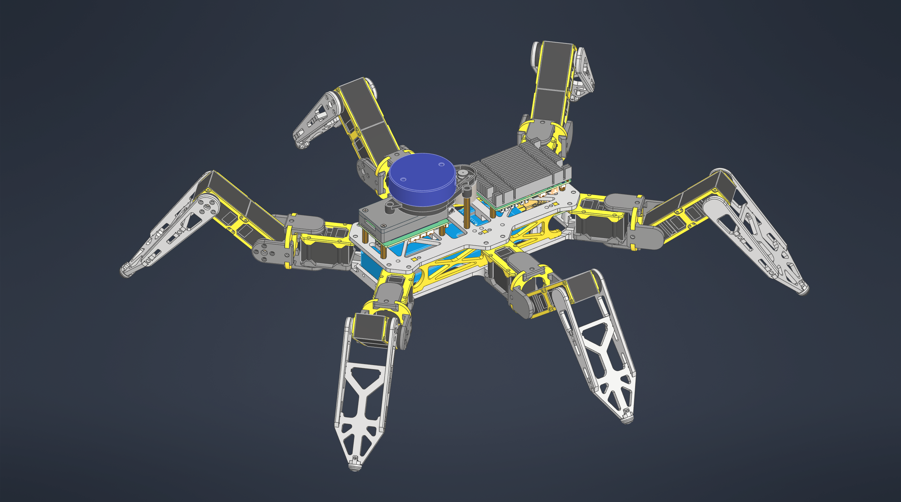
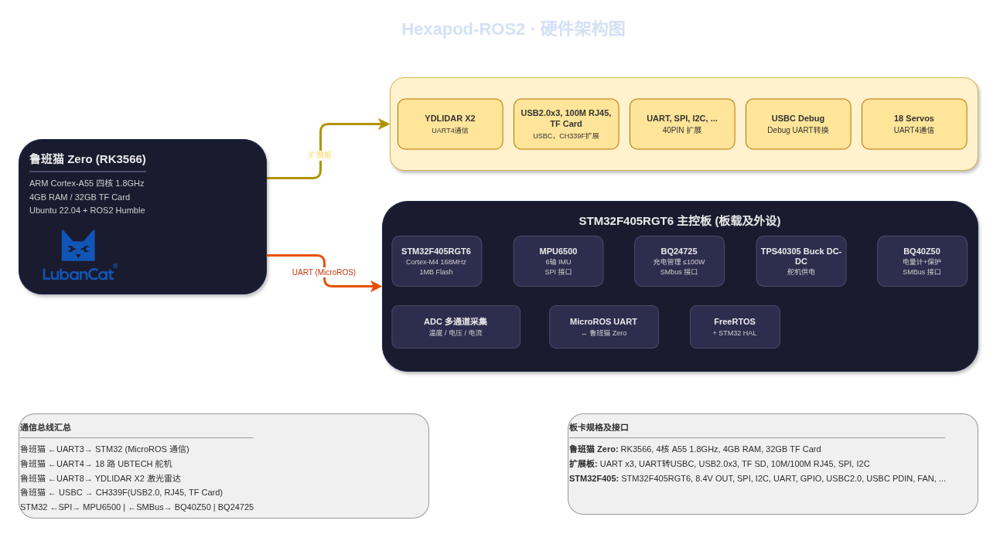
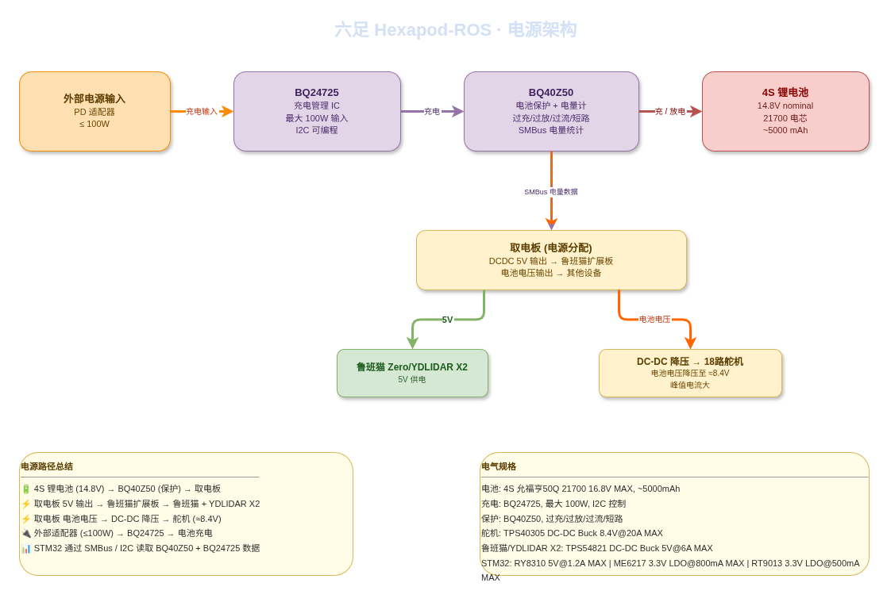

<h1 align="center">Hexapod-ROS</h1>

<p align="center">
  <strong>一个基于 ROS2 的开源六足机器人平台，支持实时步态控制、激光雷达导航</strong>
</p>
<p align="center">
  <a href="#简介">简介</a> •
  <a href="#快速开始">快速开始</a> •
  <a href="#硬件">硬件</a> •
  <a href="#软件">软件</a> •
  <a href="#参与贡献">参与贡献</a> •
  <a href="#开源许可">开源许可</a> •
  <a href="#致谢">致谢</a>
</p>


---

## 简介

### 项目概述

Hexapod-ROS 是一个开源的六足机器人平台（目前正在利用业余时间开发中）。机器人采用双处理器架构——**鲁班猫 Zero (RK3566)** 运行 ROS2 Humble，负责高层感知、路径规划与运动控制；**STM32F405RGT6** 运行 FreeRTOS 与 MicroROS，负责实时传感器融合与底层硬件驱动。18个舵机使用的是 UBTECH 的拆机舵机，具体可参考“[某宝白菜价舵机](https://gitee.com/alicedodo/xaobao_cheap_bus_servo_hack_record/)”。

**主要功能包括：**

- 18 自由度运动控制，支持逆运动学解算与多种步态模式
- 基于 360° 二维激光雷达的 SLAM 建图与自主导航（Navigation2）
- 实时 IMU 姿态估计与电池管理

<p align="center">
  
</p>

### hexapod_all.png系统架构

系统分为三个层次：**软件层**、**硬件层**和**电源层**。以下架构图提供了完整的系统总览。

#### 硬件架构

<p align="center">
  
</p>

> 架构图源文件位于 [`docs/diagrams/hardware_architecture.drawio`](docs/diagrams/hardware_architecture.drawio)。

#### 软件架构

TODO: 等待全部开发完毕

#### 电源架构

<p align="center">
  
</p>

> 架构图源文件位于 [`docs/diagrams/power_architecture.drawio`](docs/diagrams/power_architecture.drawio)。

---

## 快速开始

### 环境依赖

| 组件                          | 要求                              |
| ----------------------------- | --------------------------------- |
| **操作系统（鲁班猫/开发机）** | Ubuntu 22.04 LTS                  |
| **ROS2**                      | Humble                            |
| **MicroROS**                  | MicroROS for STM32（Humble 分支） |
| **Python**                    | ≥ 3.10                            |
| **IDE**                       | CLion、CMake                      |
| **仿真环境**                  | Gazebo 11                         |
| **3D 打印**                   | Bambu Lab A1（已测试），PETG 耗材 |

### 编译项目

**1. 克隆仓库**

```bash
git https://github.com/greenhand520/hexapod_ros.git
cd hexapod_ros
```

**2. 编译 ROS2 工作空间**

```bash
cd software/ws_hexapod_ros/
rosdep install --from-paths src --ignore-src -r -y
chmod +x ./colcon_build.sh
./colcon_build.sh
source install/setup.bash
```

**3. 编译并烧录 STM32 固件**

在 Clion 中打开 `software/hexapod_stm32f405/`，编译项目后通过 ST-Link 烧录。

## 硬件

### 主控板

| 组件                   | 规格                                                         |
| ---------------------- | ------------------------------------------------------------ |
| **鲁班猫 Zero**        | RK3566，ARM Cortex-A55 四核 1.8GHz，4GB RAM，32GB TF Card    |
| **鲁班猫 Zero 扩展板** | UART ×3、UART 转 USB-C、USB2.0 ×3、TF SD、10M/100M RJ45、SPI、I2C、etc... |
| **STM32F405RGT6**      | Cortex-M4 168MHz，1MB Flash，192KB SRAM，SPI、I2C、UART、GPIO、USB-C 2.0、USB-C PD 输入 |

### 外设与传感器

| 组件                | 描述                                     | 接口  |
| ------------------- | ---------------------------------------- | ----- |
| **UBTECH 舵机** ×18 | 6 条腿 × 3 关节，串口总线舵机            | UART4 |
| **YDLIDAR X2**      | 二维360° 激光雷达                        | UART8 |
| **MPU6500**         | 6 轴 IMU（加速度计 + 陀螺仪）            | SPI   |
| **BQ40Z50**         | 电池电量计 + 保护（过充/过放/过流/短路） | SMBus |
| **BQ24725**         | 电池充电管理 IC，最大 100W 输入          | SMBus |
| **CH339F**          | USB 2.0 Hub + 以太网 + TF Card 扩展      | USB-C |

### 电源系统

| 参数           | 值                                              |
| -------------- | ----------------------------------------------- |
| **电池**       | 4S 锂电池（标称 14.8V），约 5000mAh，21700 电芯 |
| **充电**       | BQ24725，最大 100W，SMBus 可编程                |
| **保护**       | BQ40Z50，过充/过放/过流/短路保护                |
| **舵机供电**   | TPS40305 Buck DC-DC，电池电压降压至约 8.4V      |
| **鲁班猫供电** | 取电板 5V 输出                                  |
| **STM32 供电** | 3.3V LDO                                        |

### PCB 设计

所有PCB（主控板、扩展板、取电板、电池保护版）均使用 **[JLCEDA Pro](https://pro.lceda.cn/editor/)**进行设计，对应工程文件位于 [`hardware`](hardware/) 目录下。

> 最新可以直接在线查看的 PCB 项目文件可以访问 [oshwhub 发布页面](https://oshwhub.com/) （等待所有PCB测试通过）。

### 3D 打印与机械结构

机身设计参考经典 [hexapod 项目](https://github.com/SmallpTsai/hexapod-v2-7697)的结构，在参考 STL 文件后为了适配 UBTECH 舵机和 4S 21700 电池，进行了完全的重建。采用 3D 打印完成，建模参数适应 **PETG 材料** 和 **Bambu Lab A1** 打印机。其他材料和打印机未经测试，结构强度和尺寸无法保证。打印文件和物料清单（BOM）位于 [`mechanism`](mechanism/) 目录下：

```
mechanism/
├── stl/                    # 最新可打印 STL 文件
├── step/                   # STEP 文件用于生成 urdf
├── BOM.md                  # 物料清单（紧固件、轴承等）(TODO)
└── assembly_guide.md       # 装配指南(TODO)
```

> 最新打印文件访问 [Makeword 发布页面](https://makerworld.com.cn/zh)（稍后开放）。

---

##  软件

软件分为两个主要部分：**STM32 固件** 负责实时硬件驱动，**ROS2 工作空间** 运行在鲁班猫上，负责感知、规划与控制。

### STM32 固件 (`software/hexapod_stm32f405/`)

STM32 固件基于 FreeRTOS 和 STM32 HAL 库运行，通过 MicroROS 经 UART 与鲁班猫通信。

**主要职责：**

- 发布 MPU6500 的 IMU 数据（`/imu/data` 话题）
- 发布 BQ40Z50 的电池状态（`/battery/status` 话题）
- 通过 ADC 采集并发布板载温度、电压数据和BQ24725 的充电状态（`/sensor/board_state` 话题）

### ROS2 工作空间 (`software/ws_hexapod_ros/`)

ROS2 工作空间包含运行在鲁班猫 Zero（RK3566）上的所有高层功能包，系统为 Ubuntu 22.04 + ROS2 Humble。

```
software/ws_hexapod_ros/
├── src
│   ├── hexapod_bringup
│   ├── hexapod_description
│   ├── hexapod_interface
│   ├── hexapod_sensor_interface
│   ├── hexapod_test_ubtech_servo
│   ├── hexapod_test_ubtech_servo_interface
│   ├── hexapod_ubtech_ros2_control
│   └── ydlidar_ros2_driver
├── CMakeLists.txt
├── colcon_build.sh
├── env.sh
└── generate_and_deploy_microros.sh
```

#### 功能包说明

| 功能包                              | 描述                                                         |
| ----------------------------------- | ------------------------------------------------------------ |
| hexapod_bringup                     | 系统启动的 Launch 文件和配置。按正确顺序启动所有硬件驱动、`ros2_control` 控制器、传感器节点和 MicroROS Agent。 |
| hexapod_description                 | RDF/Xacro 机器人模型、网格文件、TF 坐标系与 RViz 可视化配置。定义了 18 自由度运动学结构 |
| hexapod_interface                   | 定义了hexapod 各节点通信的 msg/service/action 文件           |
| hexapod_sensor_interface            | 定义了与 stm32 通信的 msg 文件                               |
| hexapod_test_ubtech_servo           | 测试使用 ros2_control 控制 ubtech 舵机是否正常工作的节点     |
| hexapod_test_ubtech_servo_interface | 定义测试 ubtech 舵机服务使用的 service 文件                  |
| hexapod_ubtech_ros2_control         | 使用 ros2_control 控制 ubtech 舵机，后续可更换成其他舵机，只要实现对应舵机的 ros2_control功能包即可 |
| ydlidar_ros2_driver                 | YDLIDAR X2 激光雷达 ROS2 驱动                                |
| hexapod_ik_solver                   | 将足端轨迹 (x,y,z) 转成18个关节的舵机转动角度（TODO）        |
| hexapod_gait_planner                | 将速度/朝向指令转成足端轨迹/每条腿的foot trajectory（TODO）  |
| hexapod_slam                        | 基于 SLAM Toolbox 的即时定位与建图，使用 YDLIDAR X2 点云数据。生成 2D 占据栅格地图供导航使用（TODO） |
| hexapod_navigation                  | Navigation2 导航栈配置（TODO）                               |

---

## 开发进度与路线

- [x] 硬件设计（PCB、原理图）
- [x] 3D 打印机身设计（PETG、Bambu Lab A1）
- [x] 基础 ROS2 bringup 与 ros2_control
- [ ] STM32 固件与 MicroROS 集成
- [ ] 逆运动学解算与三角步态
- [ ] YDLIDAR X2 驱动与 SLAM 集成
- [ ] Navigation2 路径规划
- [ ] RL 训练环境（Gazebo + PyBullet）
- [ ] RL 运动策略训练（PPO / SAC）
- [ ] 仿真到实物策略部署
- [ ] 多步态 RL 切换（三角步态、涟漪步态、波浪步态）
- [ ] RL + Nav2 联合自主探索
- [ ] 文档与装配视频教程

---

## 参与贡献

欢迎参与贡献！请阅读以下指南：

TODO

---

## 开源许可

本项目基于 **GNU 通用公共许可证 v3.0** 开源——详见 [LICENSE](LICENSE) 文件。

硬件设计（PCB 原理图、3D 模型）基于 **CERN 开放硬件许可 v2（CERN-OHL-P-2.0）** 开源。

---

## 致谢

排名不分先后

- [ROS2](https://docs.ros.org/) — 机器人操作系统 2
- [Xiaomi MiMo Token Plan](https://platform.xiaomimimo.com/token-plan) — 小米 MiMo 大模型 Token 订阅计划
- [CLion](https://www.jetbrains.com/clion/) — 为顺畅工作流程和高效开发而设计的跨平台 C/C++ 集成开发环境
- [MicroROS](https://micro.ros.org/) — 面向微控制器的 ROS2
- [Navigation2](https://nav2.org//) — ROS2 导航框架
- [YDLIDAR](https://www.ydlidar.com/) — 激光雷达 SDK
- [鲁班猫](https://doc.embedfire.com/linux/rk356x/quick_start/zh/latest/quick_start/lubancat/lubancat.html) — 鲁班猫 Zero 单板计算机
- [JLCEDA](https://lceda.cn/) — PCB 设计工具（立创 EDA）
- [Bambu Lab](https://bambulab.com/) — 3D 打印平台

